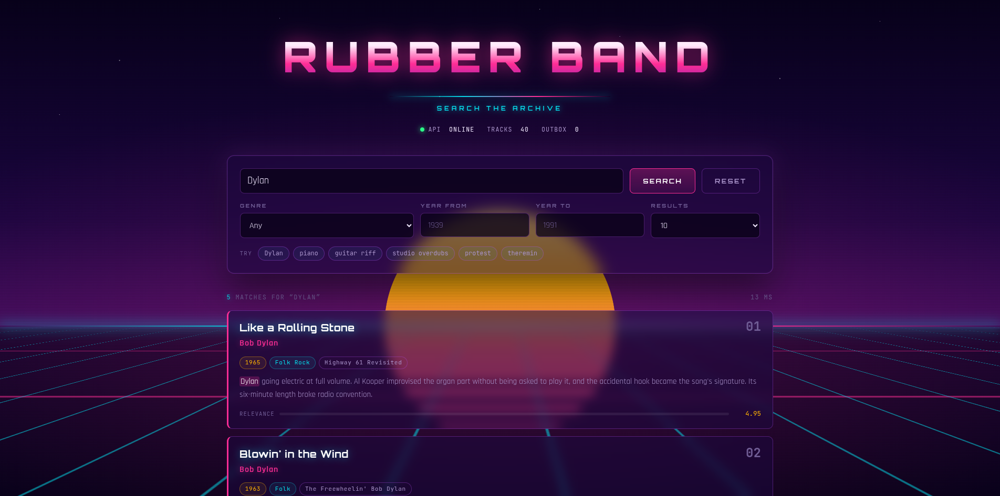

# rubber-band-ui



Synthwave front end for the [rubber-band](https://github.com/dallagnoli/rubber-band-ui-api) search API.

Vite + React + TypeScript. No UI framework, no CSS library — the whole look is
hand-written CSS in `src/index.css`.

## Run it

The API has to be up first, in the other repo:

```bash
cd ../rubber-band
docker compose up -d
dotnet run --project src/RubberBand.Api --launch-profile http   # :5225
```

Then here:

```bash
npm install
npm run dev
```

Open **http://localhost:5173**.

### Why there is no CORS setup

The API sends no CORS headers, and it isn't ours to change. The Vite dev server
proxies `/api/*` straight through to `localhost:5225` and strips the prefix, so
every request is same-origin as far as the browser is concerned. Configured in
`vite.config.ts`.

Point it somewhere else without touching code:

```bash
API_TARGET=http://192.168.1.20:5225 npm run dev
```

For a production build served by something other than Vite, set `VITE_API_BASE`
to the API's real origin and configure CORS on whatever fronts it.

## What the page does

| Element | Backed by |
|---|---|
| Search box | `GET /search?q=` |
| Genre dropdown | derived client-side from `GET /songs` — no hardcoded list |
| Year from / to | `yearFrom` + `yearTo` query params |
| Result count | `size` query param |
| Status strip | `GET /health`, `GET /songs`, `GET /admin/outbox`, polled every 10s |
| Relevance meter | the `score` on each hit, scaled against the top hit |
| Highlighted words | client-side, approximating the server's English stemmer |

Suggestion chips are seeded with terms that exist in the demo catalog, so a
first-time visitor gets real hits instead of an empty screen.

## Design

Standard synthwave vocabulary, all CSS:

- **Backdrop** (`components/Scene.tsx`) — layered gradients for the sky, a
  banded sun clipped with `mask-image`, a glowing horizon line, and a grid floor
  built from `repeating-linear-gradient` on a `perspective()` + `rotateX()`
  transform, animated by scrolling its background position. Scanlines on top via
  `mix-blend-mode: multiply`.
- **Palette** — magenta `#ff2d95`, cyan `#05d9e8`, violet `#b14aed`, amber
  `#ffb300` on near-black indigo. Neon comes from `text-shadow` and `box-shadow`,
  never from flat fills.
- **Type** — Orbitron for display, Rajdhani for body, JetBrains Mono for numbers
  and labels. Loaded from Google Fonts with system fallbacks, so it degrades
  rather than breaks offline.
- **Motion** — grid drift, star twinkle, staggered card entrance, sweeping
  loader. All of it disabled under `prefers-reduced-motion`.

## Layout

```
src/
  api.ts                 typed client + query building
  App.tsx                state, search orchestration, status polling
  index.css              the entire design system
  components/
    Scene.tsx            decorative backdrop
    SearchConsole.tsx    query box, filters, suggestion chips
    ResultCard.tsx       one hit: tags, notes, relevance meter
    StatusStrip.tsx      API health, catalog size, outbox depth
```

## Scripts

| Command | Does |
|---|---|
| `npm run dev` | Dev server on :5173 with the API proxy |
| `npm run build` | Typecheck and bundle to `dist/` |
| `npm run preview` | Serve the built bundle — **no proxy**, needs `VITE_API_BASE` + CORS |

## Notes

- In-flight searches are aborted when a new one starts, so fast typing can't land
  results out of order.
- If the API is down the status dot goes red and the error panel names the port,
  rather than showing a blank page.
- `npm run preview` does not proxy. That's a dev-server feature only.
